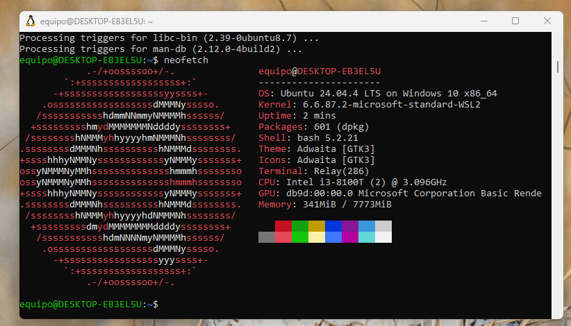
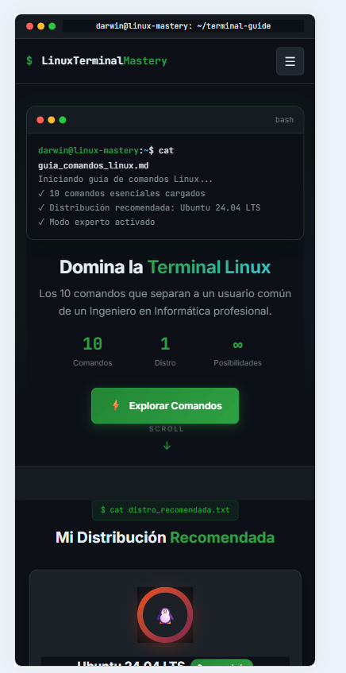
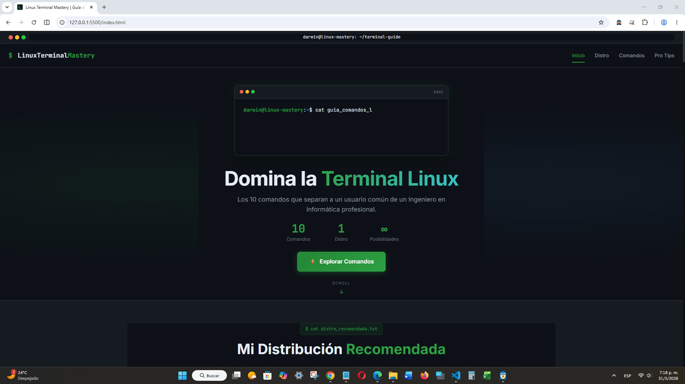

# 🐧 Linux Terminal Mastery

> **Una guía interactiva de los 10 comandos esenciales que todo Ingeniero en Informática debe dominar.**

[](https://darwinjcn.github.io/linux-terminal-guide/)
[](https://developer.mozilla.org/es/docs/Web/HTML)
[](https://developer.mozilla.org/es/docs/Web/CSS)
[](https://developer.mozilla.org/es/docs/Web/JavaScript)

---

## 🎯 Sobre el Proyecto

Este proyecto nace de la necesidad de crear un recurso técnico claro, práctico y visualmente atractivo para quienes están dando sus primeros pasos (o quieren consolidar sus conocimientos) en la administración de sistemas Linux.

La idea es simple: compartir los comandos de terminal que realmente uso en mi día a día como ingeniero, presentados de forma creativa e interactiva como si fuera un blog técnico al que yo mismo hubiera querido tener acceso cuando empecé.

**Distribución Linux recomendada:** [Ubuntu 24.04 LTS](https://ubuntu.com/download/server)

---

## 🚀 Demo en Vivo

🔗 **[Ver proyecto desplegado →](https://darwinjcn.github.io/linux-terminal-guide/)**

---

## 📸 Vista Previa

| Vista de Escritorio | Vista Móvil | Vista Web |
|:---:|:---:|:---:|
|  |  |  |

---

## 🛠️ Tecnologías Utilizadas

| Tecnología | Uso |
|:---|:---|
| **HTML5 Semántico** | Estructura accesible y SEO-friendly |
| **CSS3** | Flexbox, CSS Grid, animaciones, variables CSS |
| **JavaScript Vanilla** | Interactividad sin dependencias |
| **GitHub Pages** | Hosting gratuito y despliegue continuo |
| **JetBrains Mono** | Tipografía monoespaciada para código |
| **Inter** | Tipografía sans-serif para lectura general |

---

## 📋 Los 10 Comandos Cubiertos

| # | Comando | Categoría | Utilidad |
|:---:|:---|:---|:---|
| 01 | `ls -la` | Navegación | Listar archivos con permisos y ocultos |
| 02 | `cd / pwd` | Navegación | Navegación y ubicación absoluta |
| 03 | `chmod / chown` | Permisos | Gestión de permisos y propiedad |
| 04 | `grep -r` | Búsqueda | Búsqueda de patrones en archivos |
| 05 | `find / locate` | Localización | Localización avanzada de archivos |
| 06 | `ps aux / htop` | Monitoreo | Monitoreo de procesos del sistema |
| 07 | `tar / gzip` | Compresión | Compresión y empaquetado |
| 08 | `ssh / scp / rsync` | Remoto | Conexión remota y transferencia |
| 09 | `systemctl` | Servicios | Gestión de servicios con systemd |
| 10 | `journalctl / dmesg` | Logs | Análisis de logs del sistema |

---

## 📦 Instalación Local

### Requisitos
- Cualquier navegador moderno (Chrome, Firefox, Edge, Safari)
- [Git](https://git-scm.com/downloads) (opcional, para clonar)
- [VS Code](https://code.visualstudio.com/) (recomendado, con extensión Live Server)

### Pasos

```bash
# 1. Clonar el repositorio
git clone https://github.com/darwinjcn/linux-terminal-guide.git

# 2. Entrar al directorio
cd linux-terminal-guide

# 3. Abrir en VS Code
code .

# 4. Instalar extensión "Live Server" en VS Code
# 5. Clic derecho en index.html → "Open with Live Server"
# 6. ¡Listo! Se abrirá en http://127.0.0.1:5500
```

---

## 📁 Estructura del Proyecto

```
linux-terminal-guide/
├── index.html              # Página principal
├── favicon.svg             # Favicon del proyecto
├── css/
│   └── styles.css          # Estilos principales
├── js/
│   └── main.js             # Lógica interactiva
├── assets/
│   └── images/
│       ├── screenshots/    # Capturas de evidencia
│       │   ├── screenshot_01_terminal.png
│       │   ├── screenshot_02_ls-la.png
│       │   ├── screenshot_03_permissions.png
│       │   ├── screenshot_04_grep.png
│       │   ├── screenshot_05_find.png
│       │   ├── screenshot_06_htop.png
│       │   ├── screenshot_07_tar.png
│       │   ├── screenshot_08_ssh.png
│       │   ├── screenshot_09_systemctl.png
│       │   ├── screenshot_10_journalctl.png
│       │   ├── screenshot_11_vscode.png
│       │   ├── screenshot_12_github_repo.png
│       │   ├── screenshot_13_github_pages.png
│       │   ├── screenshot_14_responsive.png
│       │   └── screenshot_15_web.png
│       └── icons/          # Iconos del proyecto
│           └── favicon.svg
├── README.md               # Este archivo
└── .gitignore              # Archivos ignorados por Git
```

---

## ✨ Características

- 🎨 **Diseño Terminal Hacker** - Estética oscura inspirada en terminales reales
- ⌨️ **Typing Animation** - Efecto de escritura en el hero
- 📋 **Copiar al Portapapeles** - Botón en cada comando para copiar fácilmente
- 📱 **Responsive Design** - Adaptado a móvil, tablet y desktop
- 🎮 **Easter Egg** - Konami Code (↑↑↓↓←→←→BA) escondido en la página
- 🌟 **Animaciones Scroll** - Tarjetas que aparecen al hacer scroll
- 🔗 **Navegación Activa** - Indicador de sección actual
- ⬆️ **Volver Arriba** - Botón flotante para navegación rápida

---

## 📸 Capturas de Evidencia

| # | Miniatura | Descripción | Entorno |
|:---:|:---|:---|:---|
| 1 | [](https://github.com/darwinjcn/linux-terminal-guide/raw/main/assets/images/screenshots/screenshot_01_terminal.png) | Terminal con `neofetch` mostrando Ubuntu 24.04 | Linux (WSL2) |
| 2 | [](https://github.com/darwinjcn/linux-terminal-guide/raw/main/assets/images/screenshots/screenshot_02_ls-la.png) | Comando `ls -la` en acción | Linux (WSL2) |
| 3 | [](https://github.com/darwinjcn/linux-terminal-guide/raw/main/assets/images/screenshots/screenshot_03_permissions.png) | `chmod` y `chown` aplicados | Linux (WSL2) |
| 4 | [](https://github.com/darwinjcn/linux-terminal-guide/raw/main/assets/images/screenshots/screenshot_04_grep.png) | Búsqueda con `grep -r` | Linux (WSL2) |
| 5 | [](https://github.com/darwinjcn/linux-terminal-guide/raw/main/assets/images/screenshots/screenshot_05_find.png) | Localización con `find` | Linux (WSL2) |
| 6 | [](https://github.com/darwinjcn/linux-terminal-guide/raw/main/assets/images/screenshots/screenshot_06_htop.png) | Monitoreo con `htop` | Linux (WSL2) |
| 7 | [](https://github.com/darwinjcn/linux-terminal-guide/raw/main/assets/images/screenshots/screenshot_07_tar.png) | Compresión con `tar` | Linux (WSL2) |
| 8 | [](https://github.com/darwinjcn/linux-terminal-guide/raw/main/assets/images/screenshots/screenshot_08_ssh.png) | Conexión SSH exitosa | Linux (WSL2) |
| 9 | [](https://github.com/darwinjcn/linux-terminal-guide/raw/main/assets/images/screenshots/screenshot_09_systemctl.png) | Estado de servicio con `systemctl` | Linux (WSL2) |
| 10 | [](https://github.com/darwinjcn/linux-terminal-guide/raw/main/assets/images/screenshots/screenshot_10_journalctl.png) | Logs en tiempo real | Linux (WSL2) |
| 11 | [](https://github.com/darwinjcn/linux-terminal-guide/raw/main/assets/images/screenshots/screenshot_11_vscode.png) | VS Code con el proyecto abierto | Windows 11 |
| 12 | [](https://github.com/darwinjcn/linux-terminal-guide/raw/main/assets/images/screenshots/screenshot_12_github_repo.png) | Repositorio en GitHub | Navegador |
| 13 | [](https://github.com/darwinjcn/linux-terminal-guide/raw/main/assets/images/screenshots/screenshot_13_github_pages.png) | Página desplegada en GitHub Pages | Navegador |
| 14 | [](https://github.com/darwinjcn/linux-terminal-guide/raw/main/assets/images/screenshots/screenshot_14_responsive.png) | Vista responsive móvil (DevTools iPhone SE) | Navegador |
| 15 | [](https://github.com/darwinjcn/linux-terminal-guide/raw/main/assets/images/screenshots/screenshot_15_web.png) | Vista completa de la página web en escritorio | Navegador |

---

## 📝 Licencia

Este proyecto está bajo la licencia **MIT**.

```
MIT License

Copyright (c) 2026 Darwin Colmenares

Permission is hereby granted, free of charge, to any person obtaining a copy
of this software and associated documentation files (the "Software"), to deal
in the Software without restriction, including without limitation the rights
to use, copy, modify, merge, publish, distribute, sublicense, and/or sell
copies of the Software, and to permit persons to whom the Software is
furnished to do so, subject to the following conditions:

The above copyright notice and this permission notice shall be included in all
copies or substantial portions of the Software.

THE SOFTWARE IS PROVIDED "AS IS", WITHOUT WARRANTY OF ANY KIND, EXPRESS OR
IMPLIED, INCLUDING BUT NOT LIMITED TO THE WARRANTIES OF MERCHANTABILITY,
FITNESS FOR A PARTICULAR PURPOSE AND NONINFRINGEMENT.
```

---

## 👤 Autor

**Darwin Colmenares** - Ingeniero en Informática

- 🌐 [Portafolio](https://darwinjcn.github.io/)
- 💻 [GitHub](https://github.com/darwinjcn)
- 📧 colmenaresdarwin06@gmail.com

> *"La terminal no es solo una herramienta, es tu superpoder como ingeniero."*

---

<p align="center">
  <sub>Hecho con 💚 y muchas tazas de café</sub>
</p>